Stop searching for code. Start reasoning about it.

That one sentence captures the fundamental design principle behind **Repolect** -- an open-source, local-first code intelligence engine that indexes any codebase into a hierarchical semantic tree and knowledge graph, then navigates it using LLM reasoning instead of vector similarity. No API keys required, no data leaves your machine, and it works with small, efficient local models out of the box.[^1]

This post walks through the architecture, the benchmarks, the 14 MCP tools it exposes to AI editors, and how to get started in under two minutes.

---

## The Problem: Vector Search Breaks on Code

If you've built a RAG pipeline for natural-language documents, you know that vector similarity search works well when the query and the answer *look alike*. "What is photosynthesis?" and a paragraph explaining photosynthesis share vocabulary, structure, and meaning -- embeddings capture that overlap naturally.

Code is different. Code is a *structured artifact*. The gap between a question and its answer can be enormous:

> "How does payment processing work?" does not semantically resemble `stripe_adapter.py`.
>
> "Where does authentication happen?" looks nothing like the function `verify_token`.

Vector similarity will search in the wrong direction entirely. The premise of embedding-based retrieval is that similar text encodes similar meaning. But a developer asking "how does the auth flow work?" needs to find `JWTService.verify_token()` in `src/auth/jwt.py` -- a result that shares zero vocabulary with the query.

Beyond search quality, there's the **token cost problem**. Standard RAG over code works by dumping large blocks of source text into the LLM context window. On complex tasks, this means hundreds of thousands of input tokens per session -- slow, expensive, and often still imprecise.

Repolect was built to solve both problems simultaneously.

---

## A Different Architecture: The Semantic Tree

Repolect's core architecture is built on a simple insight: **code already has a natural hierarchical structure**. Repositories contain modules, modules contain files, files contain classes, classes contain functions. If every node in that hierarchy gets a pre-computed, LLM-generated summary, then a new query doesn't need to scan raw text at all. It can *navigate the tree by reasoning about meaning at each level*.

```
RepoNode: "E-commerce backend in Python/FastAPI..."
├── ModuleNode src/auth: "JWT-based authentication layer..."
│   ├── FileNode jwt.py: "Token generation and validation..."
│   │   ├── ClassNode JWTService: "Manages token lifecycle..."
│   │   └── FunctionNode verify_token: "Validates Bearer tokens..."
│   └── DocNode README.md: "Auth module documentation..."
└── ModuleNode src/payments: "Stripe payment processing..."
```

The search algorithm operates through a recursive tree traversal:

```mermaid
flowchart TD
    Start([User Query]) --> Root["1. Root Probe<br/>(Reads repo & module summaries)"]
    Root --> Branch["2. Branch Descent<br/>(Reads module & file summaries)"]
    Branch --> Leaf["3. Leaf Retrieval<br/>(Fetches source + 1-hop neighbors)"]
    Leaf --> Result([Cited Answer])
    
    style Start fill:#111827,stroke:#38bdf8
    style Result fill:#111827,stroke:#38bdf8
```



This completes in **O(log N) LLM calls** -- typically 3 steps -- rather than performing a broad similarity scan across all nodes. Every step is principled: the model is *reasoning about the meaning of module summaries*, not measuring cosine distances between embedding vectors.

---

## How Indexing Works: Bottom-Up Summarization

The indexing pipeline builds the semantic tree through a three-stage process:

### Stage 1: Hybrid Parsing

Repolect uses a three-layer parser to extract every symbol from your codebase:

| Layer | Engine | What It Does |
|---|---|---|
| **Structural** | tree-sitter | AST-based extraction of functions, classes, methods, and interfaces. Fast, accurate, supports Python, JavaScript, TypeScript, Go, Rust, Java, and more. |
| **Semantic** | LLM enrichment | Triggered for complex files (>50 lines with few symbols found) or unsupported languages. The LLM reads the file and extracts symbols as structured JSON. |
| **Fallback** | Regex patterns | Last-resort extraction that ensures something is always indexed, even fully offline. |

This hybrid approach means Repolect handles essentially any language -- if tree-sitter supports it, parsing is instantaneous; if not, the LLM fills the gap.

### Stage 2: Bottom-Up LLM Summarization

Once the symbol tree is built, Repolect generates summaries in a **post-order traversal** -- starting at the leaves and rolling intelligence upward to the root:

```mermaid
flowchart BT
    Symbols["1. Symbols<br/>(summarized from raw source)"] --> Files["2. Files<br/>(synthesized from symbols)"]
    Files --> Modules["3. Modules<br/>(synthesized from files)"]
    Modules --> Root["4. Repo Root<br/>(synthesized from modules)"]
    
    style Symbols fill:#111827,stroke:#38bdf8
    style Root fill:#064e3b,stroke:#34d399
```



This recursive synthesis ensures that high-level nodes provide a holistic architectural overview without the LLM needing to read thousands of lines of source code.

### Stage 3: Knowledge Graph Construction

In parallel with the tree, Repolect extracts structural relations between every symbol and stores them in a knowledge graph:

```
(JWTService)-[:CALLS]->(verify_token)
(auth_router)-[:IMPORTS]->(JWTService)
(AdminAuth)-[:EXTENDS]->(BaseAuth)
(PaymentHandler)-[:IMPLEMENTS]->(PaymentProtocol)
```

Four relation types -- `CALLS`, `IMPORTS`, `EXTENDS`, `IMPLEMENTS` -- enable capabilities that are impossible with a flat embedding store:

- **Blast radius analysis** -- what downstream symbols are affected if I change this function?
- **Execution flow tracing** -- follow the CALLS graph from an entry point to build a full call chain
- **Git diff mapping** -- translate changed lines into affected symbols and their downstream impact
- **Rename planning** -- find every reference site across the entire graph before renaming

Repolect supports both a lightweight **NetworkX** backend (pure Python, zero-install) and **FalkorDB** for larger codebases that need persistent graph storage and Cypher query support.

---

## The Architecture at a Glance

The architecture represents a dual-store system optimized for both semantic and structural queries:

```mermaid
graph TD
    subgraph IP ["Indexing Pipeline"]
        Scan["Scan Repo"] --> Parse["Hybrid Parse"]
        Parse --> Summarize["LLM Summarize"]
        Summarize --> Graph["Build Graph"]
    end

    IP --> Tree["tree.json<br/>(Semantic Tree)<br/>LLM-Navigable"]
    IP --> GDB["graph.db / graph.pkl<br/>(Knowledge Graph)<br/>Cypher-Ready"]

    Tree --> QL
    GDB --> QL

    subgraph QL ["Query Layer"]
        CLI["CLI Commands"]
        MCP["MCP Server<br/>(14 Tools)"]
    end
    
    style IP fill:#111827,stroke:#38bdf8
    style QL fill:#111827,stroke:#38bdf8
    style Tree fill:#1e293b,stroke:#38bdf8
    style GDB fill:#1e293b,stroke:#38bdf8
```



The tree handles **top-down semantic reasoning** (what does this code mean?). The graph handles **lateral structural traversals** (what calls what? what breaks if I change this?). Neither tool alone satisfies both query patterns efficiently -- Repolect uses both in concert.

---

## Benchmarks: 97% Token Reduction

To quantify the difference, I benchmarked Repolect's MCP tools against standard file-reading approaches across 8 complex real-world coding scenarios on Repolect's own codebase (807 nodes, 28 files).

| Metric | Without MCP Tools | With MCP Tools | Improvement |
|---|---|---|---|
| **Input tokens** | 330,363 | 10,964 | **97% reduction** |
| **Tool calls** | 87 | 17 | **5.1x fewer** |
| **Round trips** | 34 | 9 | **3.8x fewer** |
| **Tokens saved** | -- | -- | **319,399** |

For a typical coding session with 5-10 tasks, this translates to roughly:

- **~150,000-300,000 fewer input tokens** (~$0.45-$0.90 saved per session at $0.003/1K tokens)
- **30-50 tool calls reduced to 8-15**
- **30-120 seconds of eliminated latency** from fewer round trips

The performance gain isn't marginal -- it's structural. The semantic tree lets the LLM skip irrelevant code entirely, rather than reading and discarding it.

---

## 14 MCP Tools for AI Editors

Both the semantic tree and the knowledge graph are exposed via the **Model Context Protocol (MCP)**, making Repolect a live code intelligence backend for Cursor, Claude Code, Windsurf, VS Code Copilot, and Antigravity (Gemini). Setup takes one command.

The 14 tools fall into three tiers by practical impact:

### Tier 1 -- Transformative (Use on Every Task)

| Tool | What It Does |
|---|---|
| `plan_change` | Structured change plan: ADD / MODIFY / READ_ONLY / TEST_AFTER -- replaces 15+ raw tool calls with 1 |
| `tree_search` | Answers "how does X work?" using LLM reasoning over the semantic tree |
| `trace_flow` | Follows CALLS edges from an entry point -- produces a full execution graph (up to 82 nodes deep) |
| `diff_analysis` | Maps git diff to affected symbols + downstream blast radius in 1 call |

### Tier 2 -- High Value (Use Frequently)

| Tool | What It Does |
|---|---|
| `find_similar` | Find an existing implementation to use as a template before creating new code |
| `impact_analysis` | Multi-hop blast radius with test tagging for any given symbol |
| `scope_test` | Minimal test set for modified nodes with MUST / SHOULD priority tiers |
| `rename` | Multi-file rename plan using both graph traversal and text search with confidence tagging |
| `get_node` | 360-degree symbol view: source, callers, callees, all relations |

### Tier 3 -- Useful (For Specific Tasks)

| Tool | What It Does |
|---|---|
| `get_conventions` | Extract coding conventions from a module's neighborhood before modifying |
| `graph_query` | Run raw Cypher against the knowledge graph for structural questions |
| `explain_node` | LLM-powered explanation of why a symbol exists in the broader codebase context |
| `repo_summary` | Top-level codebase overview with stats and module descriptions for orientation |
| `list_repos` | Discover all indexed repositories available to the agent |

---

## Three Layers of Agent Context

Beyond individual tool calls, Repolect influences AI agent behavior through three distinct layers. Together, they create agents that don't just have *access* to codebase information -- they have *structured workflows* for using it correctly.

### Layer 1: MCP Tools -- What the Agent *Can* Do

The 14 tools described above. Structural access to both the semantic tree and the knowledge graph.

### Layer 2: `REPOLECT.md` -- What the Agent *Should* Do

Running `repolect analyze` generates a prescriptive context file at the repo root with:

- **"Always Do" rules** -- call `plan_change` before writing code, `find_similar` before creating new files, `get_conventions` before modifying unfamiliar code, `diff_analysis` before committing
- **"Never Do" rules** -- never skip impact analysis on widely-used symbols, never commit without `diff_analysis`

#### Workflow: Debugging

When investigating a bug, Repolect guides the agent through an investigation chain:


#### Workflow: Refactoring

For refactoring, structural safety is the priority:


The file uses marker-based upsert (`<!-- repolect:start -->` / `<!-- repolect:end -->`), so re-indexing replaces only the Repolect section while preserving any user-written content.

### Layer 3: Workflow Skills -- What the Agent Does in *Specific Situations*

Five static skills are auto-installed into detected editors on every `repolect analyze`:

| Skill | Trigger |
|---|---|
| `repolect-exploring` | Navigating unfamiliar code, "how does X work?" |
| `repolect-planning` | Before implementing any feature or change |
| `repolect-debugging` | Tracing bugs, investigating errors |
| `repolect-refactoring` | Renaming, extracting, restructuring |
| `repolect-reviewing` | Pre-commit safety checks, code review |

Additionally, `repolect analyze --skills` generates **per-community skills** describing each functional cluster in your codebase -- key files, entry points, cross-community connections, associated tests, and LLM-synthesized descriptions of what each area does.

Skills are auto-installed into:
- **Cursor**: `.cursor/rules/repolect-*.mdc`
- **Claude Code**: `.claude/skills/repolect/*.md`

---

## Local-First, SLM-Optimized

Repolect is engineered to run entirely on-device using small, efficient models via **Ollama**. The default configuration targets `qwen3.5:4b` or `qwen2.5-coder` -- no API keys required, no data leaves your machine.

This isn't a compromise. The vectorless architecture is *specifically well-suited to SLMs*. Because tree search navigates via structured reasoning rather than floating-point vector operations, a small model that can follow instructions reliably is all that's needed. The bottleneck shifts from model capability to index quality -- and the index is built once, offline.

For teams that prefer cloud inference, any **OpenAI-compatible endpoint** is supported:

```yaml
# ~/.repolect/config.yaml
provider: openai-compatible
base_url: https://api.openai.com/v1
model_name: gpt-4o-mini
api_key: sk-...
```

Embeddings are **optional**. Enable them via config if you want hybrid search (vector + tree), but the core search capability works without any embedding model at all.

---

## Getting Started

### Install (One Command)

The interactive installer sets up Ollama, configures your LLM provider, and makes `repolect` available system-wide:

```bash
curl -fsSL https://raw.githubusercontent.com/Bibyutatsu/Repolect/main/install.sh | bash
```

Or via pip:

```bash
pip install repolect[all]
```

### Index a Codebase

```bash
cd your-project/
repolect analyze
```

This scans the repository, parses every file, generates bottom-up summaries, builds the knowledge graph, writes `REPOLECT.md`, and installs agent skills. Depending on codebase size and your LLM provider, this typically takes 2-10 minutes.

### Ask Your First Question

```bash
repolect ask "how does authentication work?"
```

The tree search navigates the semantic hierarchy and returns cited results -- file paths, function names, and an LLM-synthesized explanation.

### Connect to Your AI Editor

```bash
repolect mcp
```

This opens an interactive setup flow that detects installed editors (Cursor, Claude Code, Antigravity, Windsurf, VS Code) and auto-writes the correct MCP configuration:

```
$ repolect mcp

  Repolect MCP Server
  ────────────────────────────────────────────────────────

  Detected editors:  [1] Cursor  ,  [2] Claude Code

  Enter numbers to auto-configure (e.g. 1,3), 'a' for all:
  → a

  Cursor       →  ~/.cursor/mcp.json     [written]
  Claude Code  →  ~/.claude.json          [written]

  Done! Restart your editor for changes to take effect.
```

After restarting your editor, all 14 MCP tools are available. The AI agent will automatically use `plan_change` before implementing features, `find_similar` before creating new code, and `diff_analysis` before committing -- guided by the prescriptive rules in `REPOLECT.md`.

---

## CLI Reference

| Command | Description |
|---|---|
| `repolect analyze` | Full index: semantic tree + knowledge graph + agent skills |
| `repolect sync` | Incremental re-index (changed files only) |
| `repolect ask "query"` | Natural-language Q&A with citations |
| `repolect why <path>` | Explain why a file or symbol exists |
| `repolect tree` | Print the semantic tree |
| `repolect graph "MATCH ..."` | Run Cypher queries on the knowledge graph |
| `repolect impact <symbol>` | Blast radius analysis |
| `repolect diff` | Map git changes to affected symbols |
| `repolect communities` | Show functional clusters (Louvain) |
| `repolect mcp` | Configure editors + start MCP server |
| `repolect viz` | Launch Streamlit graph explorer |

---

## When to Use Repolect

Repolect fits best when you're working with:

- **Large or unfamiliar codebases** -- understand architecture without reading thousands of lines
- **AI coding agents** -- give Cursor, Claude Code, or Windsurf precise structural context instead of dumping raw files into the context window
- **Local-first workflows** -- index, query, and analyze entirely on your machine with small models
- **Pre-commit safety** -- catch unintended blast radius before pushing changes
- **Team onboarding** -- new developers can ask natural-language questions and get cited, structural answers

---

## What's Next

Repolect is at **v0.1.2** and under active development. The immediate roadmap includes:

- Multi-branch indexing and cross-branch diffing
- Deeper IDE integration with inline annotations
- Performance optimizations for codebases exceeding 100K lines
- Community-contributed language support via the plugin architecture

The project is open source under the **MIT license**. Contributions, issues, and feedback are welcome.

- **GitHub**: [Bibyutatsu/Repolect](https://github.com/Bibyutatsu/Repolect){:target="_blank" rel="noopener noreferrer"}
- **PyPI**: [repolect](https://pypi.org/project/repolect/){:target="_blank" rel="noopener noreferrer"}

---

## References

[^1]: [Repolect -- GitHub Repository](https://github.com/Bibyutatsu/Repolect) - Semantic code intelligence powered by LLM reasoning.