```mermaid
flowchart TD
    subgraph "Analyzer (pure image → metrics)"
        A[Image Decode\ndecode.py] --> B[EXIF Extraction\nexif.py]
        A --> C[Sharpness\nLaplacian + Tenengrad + FFT]
        A --> D[Subject Detection\nMediaPipe face + saliency]
        A --> E[Blink Detection\nFaceMesh + EAR]
        A --> F[Exposure\nhistogram + clipping]
        A --> G[Perceptual Hash\npHash + dHash]
        A --> H[Composition\nHough lines + bbox]
    end

    subgraph "Decision Engine (metrics + thresholds → verdict)"
        I[Thresholds dataclass] --> J[Weighted quality score]
        J --> K[Verdict: keeper / review / reject]
        J --> L[Stars: 1..5]
        K --> M[Reasons list]
    end

    subgraph "Organizer / UI"
        N[FastAPI backend\nSQLite reads + mutators]
        O[React SPA\nLibrary / Triage / Organize / Settings]
        P[XMP sidecar writer]
        Q[Hierarchical organizer\ntoken-based folder tree]
    end

    C & D & E & F & G & H --> I
    M --> N
    N --> O
    N --> P
    N --> Q

    style A fill:#111827,stroke:#38bdf8
    style I fill:#111827,stroke:#38bdf8
    style N fill:#111827,stroke:#38bdf8
    style K fill:#064e3b,stroke:#34d399
    style M fill:#064e3b,stroke:#34d399
```

The obvious way to build a photo culling tool in 2026 is to throw a vision-language model at it. Feed each image to a VLM, ask "is this a good photo?", parse the answer. It works — at maybe one image every few seconds, a couple of gigabytes of weights resident, and a verdict you can't audit because it's a single probability from a black box. On an 8 GB MacBook Air with a real photo library, it's a non-starter.

**SnapGrade** is the bet that classical computer vision, applied carefully, covers what actually makes a photo a keeper or a reject. Blur, closed eyes, blown highlights, burst duplicates, horizon tilt — each has a precise, fast, interpretable measure. No transformer required. The pipeline runs at 3.3 images per second on the same 8 GB machine, re-runs are instant (SQLite cache), and every verdict comes with a human-readable reason string instead of a confidence score.

This post walks through the architecture, the metric stack, the threshold-based decision layer, and the optimization work that took throughput from 1.9 to 3.3 img/s.

---

## Three Layers That Share Nothing but SQLite

The system has three layers that share no state except the database:



The Analyzer is stateless — pure functions from `np.ndarray` to metric dataclasses, no I/O. The Decision Engine is a pure function from `(metrics_dict, Thresholds) → Verdict`. The Organizer never calls either: it reads SQLite. The UI can re-classify the entire library by changing thresholds without re-running any CV, because the metrics are already cached.

The single source of truth is `~/.snapgrade/library.db`. Files on disk are never authoritative. Re-runs skip any image whose mtime hasn't changed, which makes the second pass through a 2,000-image library effectively free.

---

## Six Metrics That Earn Their Keep

### Sharpness: Three Complementary Signals

A single sharpness metric is unreliable. Laplacian variance fires on noise as well as edges. Tenengrad (Sobel gradient energy) is more robust but can be fooled by high-contrast static subjects. FFT directional energy distinguishes camera shake (directional blur) from defocus (isotropic blur). SnapGrade combines all three.

```python
# snapgrade/metrics/sharpness.py

def laplacian_variance(rgb: np.ndarray, bbox=None) -> float:
    gray = _crop(_to_gray(rgb), bbox)
    return float(cv2.Laplacian(gray, cv2.CV_64F).var())

def tenengrad(rgb: np.ndarray, bbox=None) -> float:
    gray = _crop(_to_gray(rgb), bbox)
    gx = cv2.Sobel(gray, cv2.CV_64F, 1, 0, ksize=3)
    gy = cv2.Sobel(gray, cv2.CV_64F, 0, 1, ksize=3)
    return float(np.mean(gx * gx + gy * gy))
```

Both operate on an optional `bbox` — the subject region detected by MediaPipe. Subject-aware sharpness avoids penalizing intentional background blur (bokeh) and focuses measurement where it matters: the face, or the primary saliency region if no face is detected.


*The bounding boxes the analyzer used are visible in the UI. The orange and white rectangles are the exact regions Laplacian and Tenengrad were computed on — not the full frame.*

The combined `score` (0..1) feeds the decision engine. Below 0.30 is an automatic reject; above 0.55 is keeper-quality.

### Blink Detection: Eye Aspect Ratio

Closed-eye detection uses MediaPipe FaceMesh to extract 468 facial landmarks per detected face, then computes the **Eye Aspect Ratio (EAR)** — vertical eye extent over horizontal. Below 0.20 indicates a closed or nearly-closed eye.

The design choice that matters: EAR is per-face, and `any_closed = True` if *any* face in the frame has a closed eye. For group portraits this is conservative on purpose — one blinking person rejects the frame. Both the threshold and the `reject_closed_eyes` flag are configurable.

### Burst Grouping: Union-Find on Perceptual Hashes

Bursts are grouped by two criteria: perceptual hash distance (64-bit pHash, Hamming distance ≤ 10 bits) and capture timestamp proximity (within 3 seconds). A union-find merges connected components in O(N α(N)):

```python
# snapgrade/group.py

class _UnionFind:
    def __init__(self, n: int) -> None:
        self.parent = list(range(n))

    def find(self, x: int) -> int:
        while self.parent[x] != x:
            self.parent[x] = self.parent[self.parent[x]]  # path compression
            x = self.parent[x]
        return x

    def union(self, a: int, b: int) -> None:
        ra, rb = self.find(a), self.find(b)
        if ra != rb:
            self.parent[rb] = ra
```

Within each burst group, frames are ranked by a weighted quality score — sharpness 45%, eye openness 20%, aesthetic 13%, exposure 12%, smile 10%, highlight clipping −10% — and the top frame is marked `best_image_id`. The UI filter "best-of-burst only" collapses a 600-frame event to roughly 90 candidates.

---

## Thresholds Over Models: Why the Decision Layer Is 40 Lines

The decision engine is a pure function with no imports from the metrics layer — it takes a plain `dict` of metric results and a `Thresholds` dataclass:

```python
# snapgrade/decide.py

@dataclass
class Thresholds:
    sharp_keeper: float = 0.55   # >= → keeper-quality sharpness
    sharp_reject: float = 0.30   # < → auto-reject
    accept_overexposed: bool = False
    accept_underexposed: bool = False
    reject_closed_eyes: bool = True
    horizon_warn_deg: float = 3.0  # warn only, never auto-rejects

    # Star score weights
    w_sharpness: float = 0.50
    w_exposure: float = 0.18
    w_eyes: float = 0.14
    w_composition: float = 0.08
    w_aesthetic: float = 0.10
```

Each sub-score is computed independently (exposure histogram analysis, EAR-to-score mapping, composition tilt scoring) and combined into a 0..1 quality score. Stars bin from the continuous score: ≥0.80 → 5 stars, ≥0.65 → 4 stars, and so on. Hard threshold checks come first — sharpness below `sharp_reject`, or `reject_closed_eyes` with any face blinking — so a hard reject doesn't get softened by a strong aesthetic score.

The `Thresholds` dataclass serializes to JSON and lives in the database. The UI mutates it and re-classifies the whole library without touching any image file. That's why the Settings screen feels instant:


*The Settings screen is a direct projection of the `Thresholds` dataclass. Moving a slider triggers a re-classification query, not a re-analysis — the metrics are already in SQLite.*

The whole thing is around 40 lines of decision logic and a dataclass. A VLM call would give you a verdict and nothing to tune.

---

## From 1.9 to 3.3 img/s: What Actually Moved the Needle

The initial pipeline ran at 1.90 img/s on 53 test images. Getting to 3.28 img/s on 2,070 images required two changes — neither in the CV.

### The Decode Was the Bottleneck

Profiling showed image decoding (rawpy for RAW, Pillow for JPEG/HEIC) dominated wall time — often more than the CV inference itself. Two fixes:

1. **PIL draft mode.** JPEGs are decoded at a reduced resolution using Pillow's draft mode, which skips decompression work when full resolution isn't needed for the analysis pass.
2. **EXIF fast path.** If an embedded JPEG thumbnail exists in the RAW's EXIF, SnapGrade uses that instead of a full RAW decode. A 1200px embedded preview is sufficient for sharpness and exposure metrics.

### Thread-Local YuNet

MediaPipe and OpenCV's YuNet face detector aren't thread-safe across threads. The first implementation shared a single global model instance, which serialized all inference through a lock. The fix is thread-local storage so each worker initializes its own model:

```python
_tls = threading.local()

def _get_detector() -> cv2.FaceDetectorYN:
    if not hasattr(_tls, "detector"):
        _tls.detector = cv2.FaceDetectorYN.create(...)
    return _tls.detector
```

Lock contention disappeared and parallel inference became real.

### Numbers

| Corpus | Phase | Wall time | Throughput | Notes |
|---|---|---|---|---|
| 2,070 images | Pre-optimization | 767.6 s | 2.70 img/s | Single-threaded decode, shared model |
| 2,070 images | Post-optimization | 630.7 s | **3.28 img/s** | Draft decode + thread-local models |
| 53 images | Re-run (cached) | 0.00 s | — | mtime match, zero re-processing |

The cached re-run at 58.5 MB RSS is the number I'm most satisfied with — the second pass through a library is effectively free, which matters when you're iterating on threshold tuning.

---

## SQLite Is the Index

All analysis results live in `~/.snapgrade/library.db`. The schema uses a JSON blob column for metrics rather than individual columns — adding a metric never needs a migration, it just appears in the blob on the next analysis run. Fields are promoted to dedicated columns only when they need indexing (`verdict` and `stars`, because the UI filters on them constantly).

WAL mode is on, so read-heavy UI queries don't block background ingest writes. The organizer, XMP writer, and report generator all read this cache — they never touch image files directly.

The payoff: the React UI is a thin client. Every filter, every threshold tweak, every burst-grouping rerun is a SQL query against cached metrics. There's no "rebuild index" step, because the index is the database and the database is the index.

---

## Run It Yourself

```bash
git clone https://github.com/Bibyutatsu/SnapGrade
cd SnapGrade
uv sync --all-extras

# Analyze a folder
uv run snapgrade analyze /path/to/photos

# Group bursts (loosen thresholds if your bursts are wider than 3s)
uv run snapgrade group --hamming 14 --seconds 30

# Start the API + UI
uv run snapgrade serve   # → http://127.0.0.1:8765

# Write XMP sidecars for rated images
uv run snapgrade write-xmp /path/to/photos

# Run tests
uv run pytest
```

The optional models — aesthetic scoring (CoreML NIMA), semantic search (MobileCLIP), face clustering (InsightFace `buffalo_s`), OCR, and content-type classification — are gated behind environment variables or CLI flags. The base pipeline runs without any of them.

---

## What's Still Open

The next significant piece is smarter **subject segmentation** through the already-wired `subject_seg.py` module — separating foreground from background should improve sharpness scoring on images with complex depth of field. There's also an open question about whether the opt-in NIMA aesthetic model is pulling its weight relative to the compositional signals that already run unconditionally.

Source, issues, and full design rationale on GitHub:

[SnapGrade on GitHub](https://github.com/Bibyutatsu/SnapGrade){:target="_blank" rel="noopener noreferrer"}

---

## References

[^1]: [Tenengrad focus measure — Pertuz et al., 2013](https://www.sciencedirect.com/science/article/pii/S0031320312004736) — comparative study of focus measures including Tenengrad and Laplacian variance
[^2]: [Eye Aspect Ratio for blink detection — Soukupová & Čech, 2016](http://vision.fe.uni-lj.si/cvww2016/proceedings/papers/05.pdf) — original EAR formulation using facial landmarks
[^3]: [pHash — perceptual image hashing](http://phash.org/) — basis for burst grouping
[^4]: [MediaPipe FaceMesh](https://ai.google.dev/edge/mediapipe/solutions/vision/face_landmarker) — 468-landmark facial geometry used for EAR computation
[^5]: [NIMA: Neural Image Assessment](https://arxiv.org/abs/1709.05424) — aesthetic scoring model, opt-in CoreML inference
